<h1 align="center">AstroPi</h1>

<b>Gear for astrophotography experience</b>

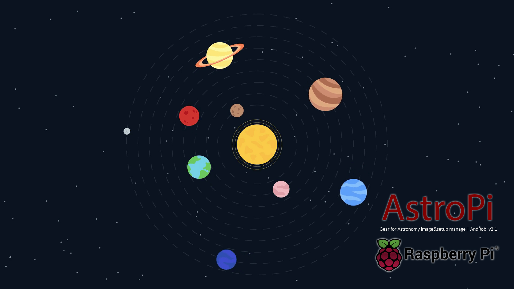

1.0 Introduzione | 2.0 Prima accensione | 3.0 Astrofotografia | 4.0 Approfondimento Ekos
:--------- | :--------- | :--------- | :---------
1.1 Cos'è AstrPi | <a href="#21-Prima-connessione">2.1 Prima connessione</a> | <a href="#31-Configurare-Kstars">3.1 Cofigurare Kstars</a> | 4.1 Messa a fuoco
1.2 Come funziona | <a href="#22-Connettersi-al-WiFi">2.2 Connettersi al WiFi</a> | 3.2 Configurare i devices e i setup | 4.2 Allineamento polare
1.3 Pre-requisiti | <a href="#23-Connessione-remota-VNC">2.3 Connessione remota VNC</a> | 3.3 Prima sessione fotografica | 4.3 Pagina CCD
3.4 Fonti e ringraziamenti | 2.4 Aggiornamento e backup | | 4.4 Pagina guida
| | | | 4.5 Scheduler

___

# 2.1 Prima connessione
> Il sitema AstroPi viene fornito pienamente funzionante e completo di tutto ciò che seve per eseguire sessioni di astrofotografia deep-sky e/o planetario, pianificaione di osservazioni e molto altro. 
:warning: E' scosigliato l'utilizzo del terminale per evitare inaspettati malfunzionamenti del sistema, AstroPi è stato minimizzato e focalizzato per l'utilizzo astronomico e astrofotografico. (per dubbi, richeste e aiuto utilizzare la pagina "ISSUE" qui su GitHub) 
 
Una volta avviato in pochi secondi è pronto per ricevere connessioni remote via VNC. Ovviamnete AstroPi non è ancora connesso alla vostra rete WiFi (per connessioni cablate ETH procedere comunque prima con la connessione Hot-Spot) quindi in automatico viene generato un Hot-spot denominato "AstroPi". In sostanza in assenza di connessioni ad internet AstroPi genera sempre un hotspot in modo da potersi connettere direttamente e controllarlo da remoto (funzione disattivabile attraverso il programma AstroPi System).
 
Questa soluzione di connessione hotspot è molto utile se le sessioni fotografiche vengono svolte in campo aperto dove wifi o rete cablata sono assenti. Tuttavia connettendosi in Hot-Spot AstroPi sarà privo di connessione ad internet, precludendo ogni possibilità di aggiornamento del sistema, download dei cataloghi astronomici, immaggini DSS per il planetario e assistenza remota.

## Connessione attraverso hotspot e configurazione di VNC

Istruzione | Screenshot 
:--- | :---  
Con il nostro pc andiamo sull'icona delle connesioni di rete e cerchiamo la rete denominata AstroPi, ci connettiamo e verrà chista una password di rete, la password è: 1234567890  Una volta connessi alla rete il nostro pc non sarà più connesso a internet, ma connesso solo e direttamente ad AstroPi che fungerà da router  __Nome rete: AstroPi__ __Password rete: 1234567890__ | 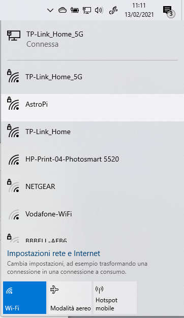
Apriamo VNC Viewer precedentemente installato. Andiamo nel menu "File" e poi "New connection" e compiliamo i dati "VNC Server" e "Name" come da foto e diamo "OK".   __VNC Server: 10.0.0.5__ __Name: AstroPi HotSpot__ | 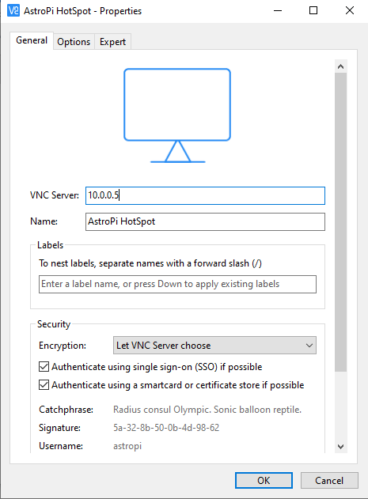
Ora nella schermata di VNC abbiamo una nuova icona chiamata "AstroPi HotSpot" apriamola e inseriamo nome utente "astropi" e password "astropi". Spuntiamo la voce "Remember password" (se non vogliamo dover immettere ogni volta la password di accesso) e "Ok"  __Username: astropi__ __Password: astropi__ | 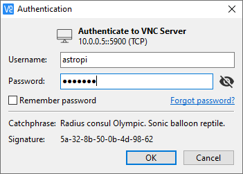

### Congratulazioni! In pochi minuti hai avuto accesso al tuo AstroPi in modalità HotSpot
___

# 2.2 Connettersi al WiFi
> Ora che siamo connessi e possiamo utilizzare AstroPi possiamo connetterlo alla nostra rete WiFi per poter accedere a tutte le funzionalità, aggiornamenti e comodità di avere il sistema condiviso in rete. 

## Configuriamo la connessione ad una rete Wifi

Istruzione | Screenshot 
:--- | :---  
Apriamo il File Manager e nella Home troviamo l'icona del programma "AstroPi System", apriamolo con doppio click. Clicchiamo su "Esegui" nella finestra che appare, e inseriamo la password di AstroPi "astropi" nella schermata di AstroPi System scegliamo dalla lista la voce "Setup my WiFi" | 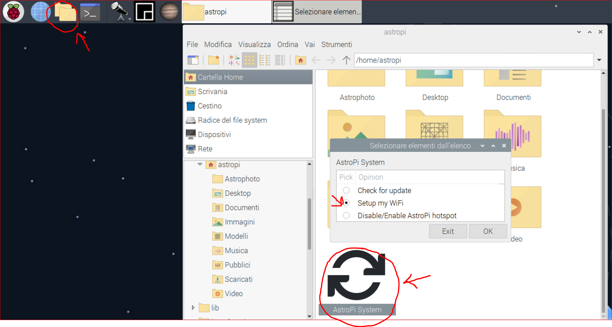
Inesiamo il SSID della rete WiFi alla quale vogliamo connetterci avendo cura dell'ortografia (il SSIDI è case sensitive) e inseriamo la password della rete WiFi Al prossimo riavvio AstroPi si connettrà automaticamente alla tua rete. Riavviamo AstroPi e disconnettiamo VNC! Connettiamo il PC alla nostra rete | 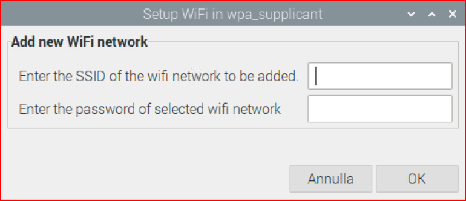

### Ora il tuo AstoPi è pronto per essere connesso alla tua rete con accesso a internet
___

# 2.3 Connessione remota VNC
> Avendo seguito i passaggi precedenti il nostro AstroPi è ora connesso alla nostra rete e a internet. Per poterci connettere, avendo cambiato il tipo di connessione da HotSpot a WiFi, bisogna creare un'altra icona di connessione su VNC che servirà per controllare AstroPi quando è connesso alla nostra rete

## Connessione tramite WiFi e configurazione di VNC

Istruzione | Screenshot 
:--- | :---  
Connettiamo il nostro PC alla nostra rete WiFi o cablata (la stessa rete alla quale vogliamo connettere AstroPi) e apriamo VNC dove troviamo l'icona precedentemente creata "AstroPi HotSpot" Andiamo nuovamente su "File" e "New connection" e inseriamo come da foto "astropi" in "VNC Server" e "AstroPi di PIPPO" (sostituire "PIPPO" con il vostro nome) in "Name" | 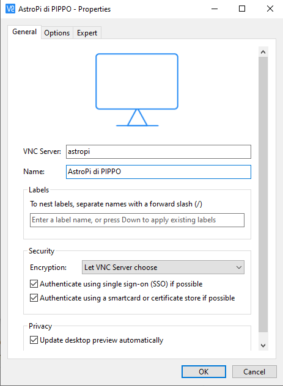
Ora nella schermata di VNC abbiamo una nuova icona chiamata "AstroPi di PIPPO" apriamola e inseriamo nome utente "astropi" e password "astropi". Spuntiamo la voce "Remember password" per non dover immettere ogni volta la password di accesso  __Username: astropi__ __Password: astropi__ | 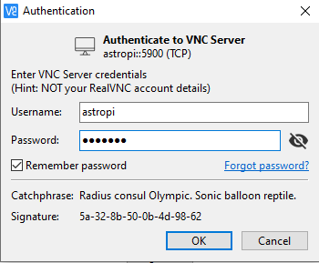

### Sei pronto! Ora hai il pieno controllo di AstroPi e in ogni caso sarai in grado di accedervi da remoto!
___

# 3.1 Configurare Kstars
> KStars è un software di astronomia multipiattaforma gratuito, open source. Fornisce un'accurata simulazione grafica del cielo notturno, da qualsiasi luogo sulla Terra, in qualsiasi data e ora. Il display include fino a 100 milioni di stelle, 13.000 oggetti nel cielo profondo, tutti gli 8 pianeti, il Sole e la Luna, e migliaia di comete, asteroidi, supernovae e satelliti. Per studenti e insegnanti, supporta velocità di simulazione regolabili al fine di visualizzare fenomeni che si verificano su lunghe scale temporali, l'Astrocalculator KStars per prevedere le congiunzioni e molti calcoli astronomici comuni.Per l'astronomo dilettante, fornisce un pianificatore di osservazione, uno strumento di calendario del cielo e un editor FOV per calcolare il campo visivo delle attrezzature e visualizzarle.  Scopri oggetti interessanti nello strumento "What's up Tonight", traccia grafici di altitudine e tempo per qualsiasi oggetto, stampa grafici del cielo di alta qualità e ottieni l'accesso a molte informazioni e risorse per aiutarti a esplorare l'universo! Inclusa in KStars è la suite di astrofiografia Ekos, una soluzione di astrofiografia completa in grado di controllare tutti i dispositivi INDI tra cui numerosi telescopi, CCD, DSLR, focuser, filtri e molto altro. Ekos supporta il tracciamento altamente accurato utilizzando il risolutore di astrometria online e offline, la messa a fuoco automatica e le funzionalità di guida automatica e l'acquisizione di immagini singole o multiple utilizzando il potente gestore di sequenze integrato.
 Source [Kstars site](https://edu.kde.org/kstars/) for more info.
 

:warning: La versione di Kstars NON è quella ufficiale KDE ma una variante modificata ad-hoc per AstroPi, per eventuali malfunzionamenti o chiarimenti utilizzare quindi i seguenti link:
* [Discussioni generali](https://github.com/Andre87osx/AstroPi-system/discussions)
* [Problemi e suggerimenti](https://github.com/Andre87osx/AstroPi-system/issues)
 
## Primo avvio di Kstars e configurazione opzioni utente

Istruzione | Screenshot 
:--- | :---  
Al primo avvio viene mostrata una schermata di benvenuto e pre-confugurazione, inseriamo come località del sito osservativo la più vicina a noi (in un secondo passaggio perfezioneremo la nostra località inserenod Latitudine e Longitudine precisi del nostro sito osservativo), | 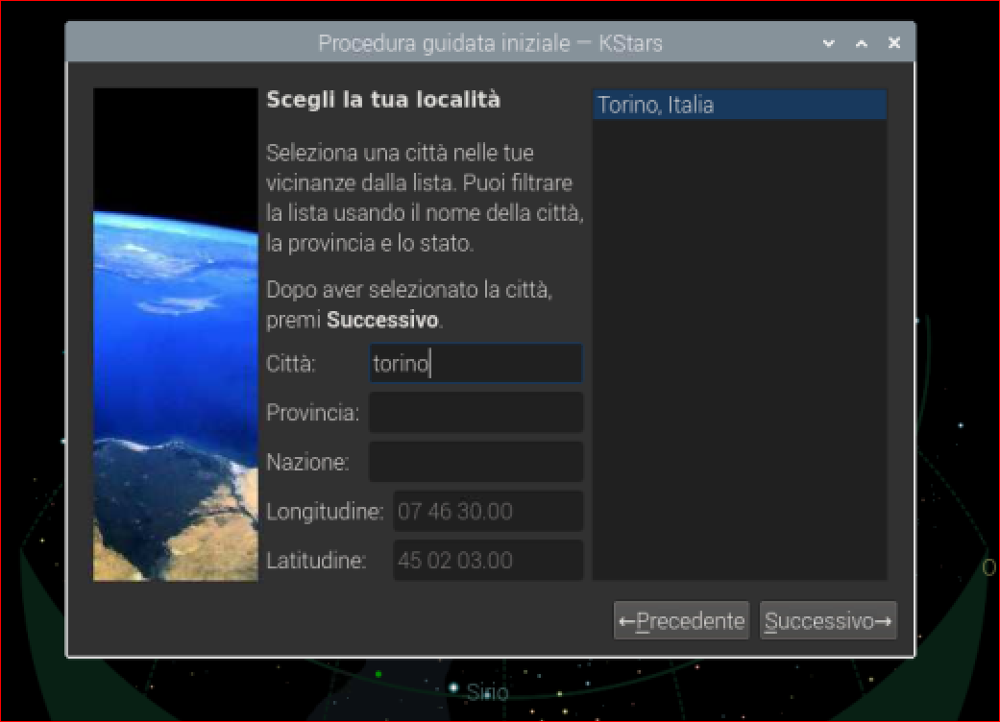
La schermata successiva ci permette di scaricare i dati aggiuntivi quali cataloghi e raccolte astronomiche e le immagini degli oggetti per il planetario. Si può installare tutto quello che viene proposto (attendere il termine dell'installazione prima di chiudere la finestra) Ora non ci resta che personalizzare il planetario (N.B: le opzioni di default di Kstars AstroPi differisco da quelle ufficiali) | 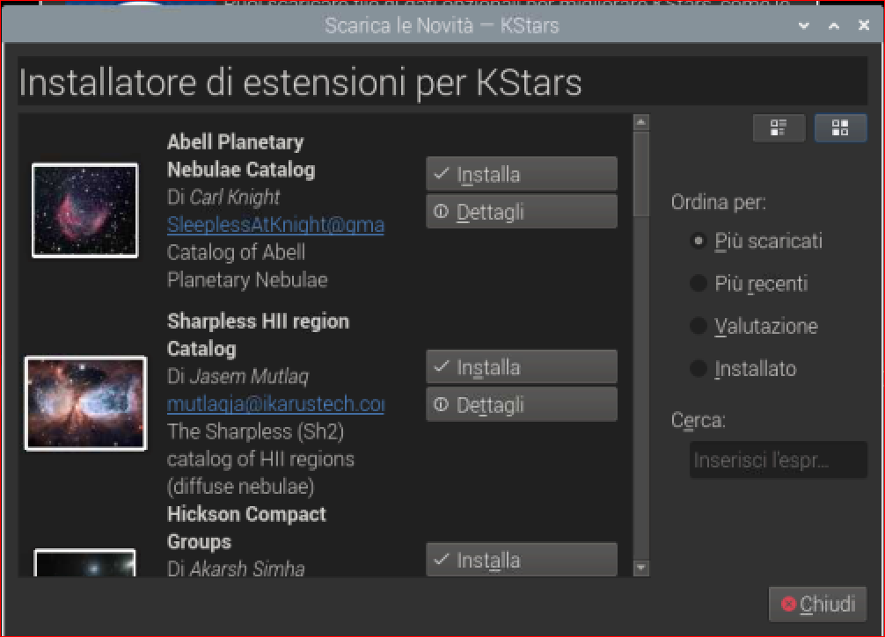
Menu "Impostazioni" > "***Simboli CDV***" > "Modifica Simboli CDV" Qui creiamo il reale campo di vista iquadrato dal nostro setup così avremo un'idea chiara del campo inquadrato potendolo testare sul planetario. Possiamo inserire campi di vista per oculari e per CCD e Reflex. Dal menu "Impostazioni" > "Simboli CDV" possiamo attivare o disattivare i vari campi di vista | 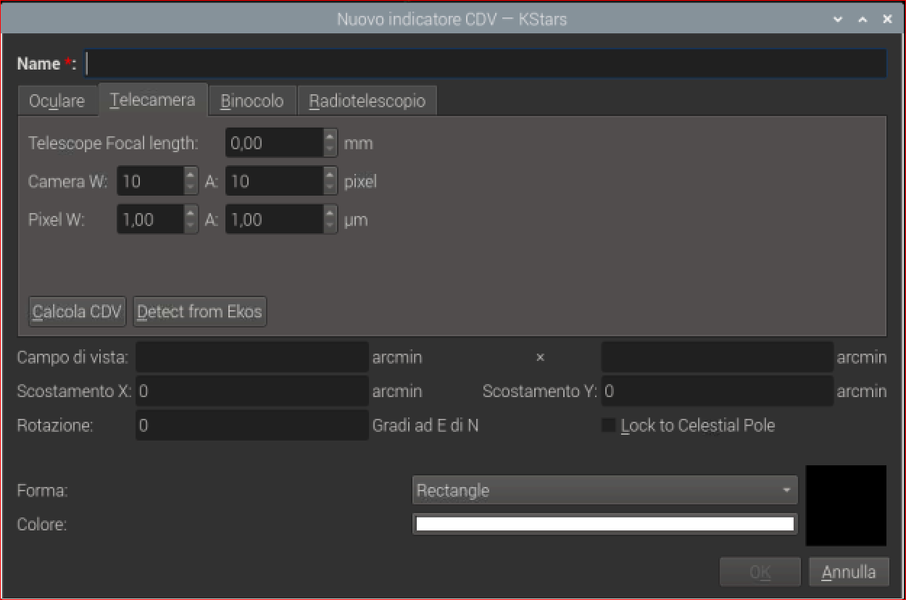
Menu "Impostazioni" > "***Manage Observer***" Possiamo inserire i nostri dati che verrano salvati nei metadati dei FITT o RAW. | 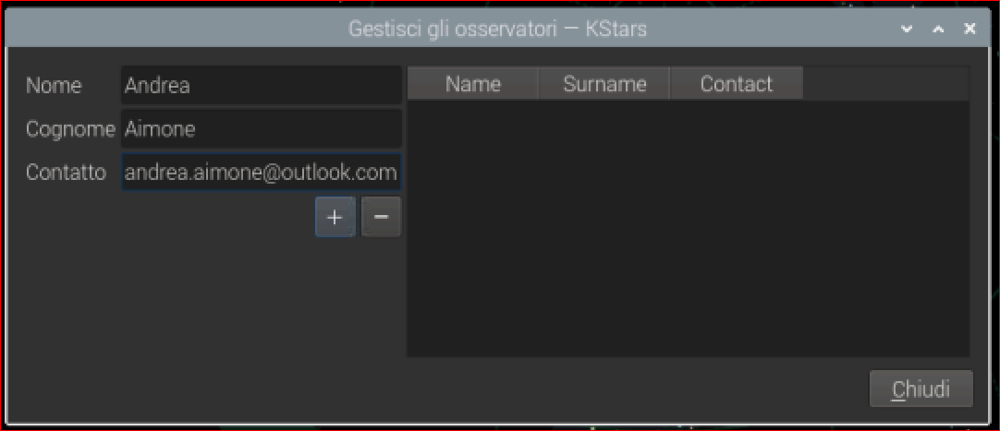

### C'è molto di più da scoprire! Visitate la pagina [Discussion](https://github.com/Andre87osx/AstroPi-system/discussions/categories/kstars-guida-e-trucchi) o la guida ufficiale di [Kstars](https://docs.kde.org/trunk5/en/kstars/kstars/index.html) 
___
